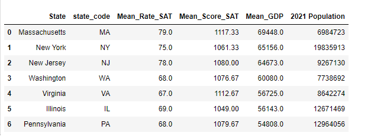
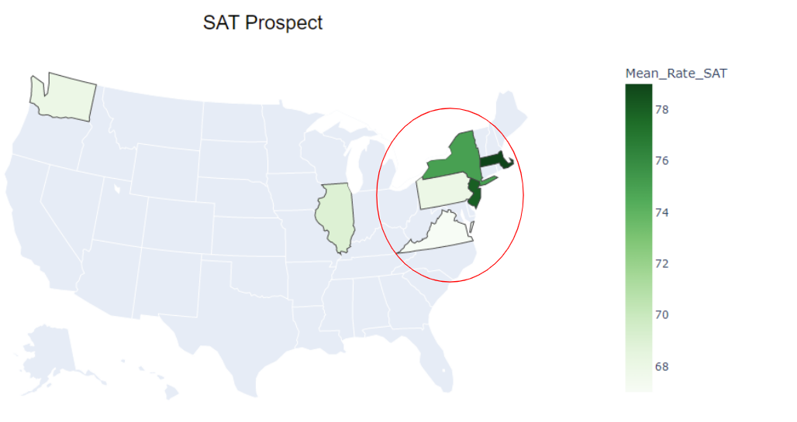

#  Project 1: Standardized Test Analysis

### Overview

For our first project, we're going to take a look at aggregate SAT and ACT scores and participation rates in the United States. We'll seek to identify trends in the data and combine our data analysis with outside research to address our problem statement.

The SAT and ACT are standardized tests that many colleges and universities in the United States require for their admissions process. This score is used along with other materials such as grade point average (GPA) and essay responses to determine whether or not a potential student will be accepted to the university.

The SAT has two sections of the test: Evidence-Based Reading and Writing and Math ([*source*](https://www.princetonreview.com/college/sat-sections)). The ACT has 4 sections: English, Mathematics, Reading, and Science, with an additional optional writing section ([*source*](https://www.act.org/content/act/en/products-and-services/the-act/scores/understanding-your-scores.html)). They have different score ranges, which you can read more about on their websites or additional outside sources (a quick Google search will help you understand the scores for each test):
* [SAT](https://collegereadiness.collegeboard.org/sat)
* [ACT](https://www.act.org/content/act/en.html)

Standardized tests have long been a controversial topic for students, administrators, and legislators. Since the 1940's, an increasing number of colleges have been using scores from sudents' performances on tests like the SAT and the ACT as a measure for college readiness and aptitude ([*source*](https://www.minotdailynews.com/news/local-news/2017/04/a-brief-history-of-the-sat-and-act/)). Supporters of these tests argue that these scores can be used as an objective measure to determine college admittance. Opponents of these tests claim that these tests are not accurate measures of students potential or ability and serve as an inequitable barrier to entry.

### Problem Statement

We are a group of academia specialists, hired by for-profit institutions in the US to identify states with growth potential in the private tuition needs for college admissions.

Given that our clients has limted resources, we have been taksed to identify which is the more popular test out of the 2, SAT or ACT.

In addition to that, we will need identify, out of the 50 states, which states has the most potential.

---

### Datasets

#### Provided Data

Listed below are the datasets included in the [`data`](../data/) folder for this project. 

* [`act_2017.csv`](../data/act_2017.csv): 2017 ACT Scores by State ([source](https://blog.prepscholar.com/act-scores-by-state-averages-highs-and-lows))
* [`act_2018.csv`](../data/act_2018.csv): 2018 ACT Scores by State ([source](https://blog.prepscholar.com/act-scores-by-state-averages-highs-and-lows))
* [`act_2019.csv`](../data/act_2019.csv): 2019 ACT Scores by State ([source](https://blog.prepscholar.com/act-scores-by-state-averages-highs-and-lows))
* [`act_2019_ca.csv`](../data/act_2019_ca.csv): 2019 ACT Scores in California by School
* [`sat_2017.csv`](../data/sat_2017.csv): 2017 SAT Scores by State ([source](https://blog.collegevine.com/here-are-the-average-sat-scores-by-state/))
* [`sat_2018.csv`](../data/sat_2018.csv): 2018 SAT Scores by State ([source](https://blog.collegevine.com/here-are-the-average-sat-scores-by-state/))
* [`sat_2019.csv`](../data/sat_2019.csv): 2019 SAT Scores by State ([source](https://blog.prepscholar.com/average-sat-scores-by-state-most-recent))
* [`sat_2019_by_intended_college_major.csv`](../data/sat_2019_by_intended_college_major.csv): 2019 SAT Scores by Intended College Major ([source](https://reports.collegeboard.org/pdf/2019-total-group-sat-suite-assessments-annual-report.pdf))
* [`sat_2019_ca.csv`](../data/sat_2019_ca.csv): 2019 SAT Scores in California by School
* [`sat_act_by_college.csv`](../data/sat_act_by_college.csv): Ranges of Accepted ACT & SAT Student Scores by Colleges ([source](https://www.compassprep.com/college-profiles/))

#### Additional Data
* [`SAGDP1__ALL_AREAS_1997_2021.csv`](../data/SAGDP1__ALL_AREAS_1997_2021.csv): GDP by state from 1997 - 2021 ([source](https://www.bea.gov/data/gdp/gross-domestic-product)
* [`NST-EST2021-alldata.csv`](../data/NST-EST2021-alldata.csv): Population estimate 2021 ([source]( https://www2.census.gov/programs-surveys/popest/datasets/2020-2021/state/totals/)

---

### Data Cleaning
In this project, we have combined all the data from SAT & ACT 2017 - 2019 into one dataframe,
allowing us to easily refer to one single dataframe for majority of the codes.

We have also added additional data sets pertaining to GDP Per Capita by states, and also Population by states.

---

### Analysis
We first identified that ACT seems to be more popular than SAT, as it seems that overall ACT has a higher participation rate across the country.

Further investigations revelaed that ACT's popularity was due to more states having ACT as the default education track.

([source](https://testive.com/state-sat-act/))
- 18 states has requirements for ACT
- 11 states has requirements for SAT

However after factoring in GDP Per Capita,
we soon realised that SAT was the more popular test among states with above average GDP.

We than further narrowed down our prospective states using the criteria:
1) States must have above average population
2) States must have below average Scores 
3) States must have above average GDP per capita
4) States must have above 65% test participation rate

In the end we are left with 0 States with potential for ACT
and 7 States with potential for SAT.

From the above, we came into the conclusion that it will be more profitable to focus on SAT, as we observed from the data that states with above average mean tends to favour SAT over ACT.

We then further analysed the 7 Prospective states to further narrowing it down to 5 states for our client to choose from.

---

### Conclusion and Recommendation

We then visualize the data using the Choropleth chart.

Given the limited resources, we have identified that SAT is the more profitable tests to target, and also the 5 States that was identiefied are right next to each other, 
this will give our client an added advantage with regards to management, logistics and resource planning, given the close proximity.

