# Ames Housing: A Model for Price Prediction
---

### Problem Statement

We are WEM general insurance based in Ames, Iowa specializing in home insurance.
The issue here is that customers has feedback to us that our existing form are Tedious and overly complicated.  
This has translated to higher dropout rate and loss of revenue. 
This has caught the management's attention and has noted that our competitors are offering a quicker and more accurate solution to this issue.

The Ames data set has many parameters (80 independent and 1 dependent variable) that can either assist or distort the predictive model. The problem is which features should be used in our predictive model from the information provided from the parameters and predict Sales Price with the lowest root mean square error with the references from Kaggle 

A successful outcome would be deriving an approach in treating the parameters and transforming the object variables into usable variables in the predictive model. From there, we can best determine if Lasso, Ridge or Linear Regression will be the chosen model for this problem.

---

### Data Dictionary
The Ames Housing Dataset is an exceptionally detailed and robust dataset with 81 columns of different features relating to houses which includes 39 numerical value features and 42 categorical features of which are 2 IDs.

A detailed description of each variable in the data set can be found [here](https://www.kaggle.com/competitions/dsi-us-11-project-2-regression-challenge/data).

---

### Analysing Data set 

With the sales Price as the dependent variable y, we did an anlysis on its distribution.

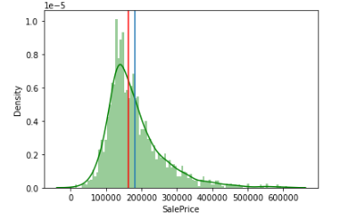  
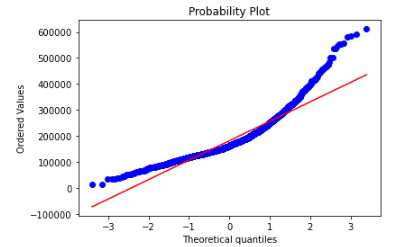  

We can see that there is a pronounced curve on the Sales price. The target variable is right skewed. As linear models tends to work better in a normal distribution, we need to transform this variable and make it more normally distributed.

To normalise it, we used the log function.
---
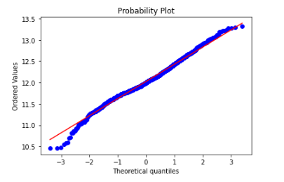  

---

### Skewed features

Some features have a very high % of a single value. Such features are usually poor predictors and can be dropped.  
For e.g. Asking a customer if his house has utilities in this day and age is seemingly redundant.
another e.g. would be asking if the customer's house have a pool or not? (we know a huge majority of people don't!)
For the purpose of this project, we dropped features that has more than 70% of a single value (includes Null values)  
Features listed below were dropped:  
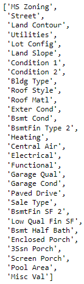  

---

### Feature engineering

Some features were combined

|Feature|Data Type|Data Description|
|:--|:--|:--|
|'Bath'|Numerical > 0|sum of Bath & half Baths|
|'Non Liv Area'|Numerical > 0|'Lot Area' - 'Gr Liv Area'|  

After dropping redundant columns, we are left with 27 features.

---

### Outliers

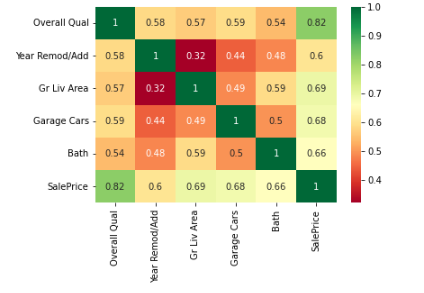    
We determined the outliers against the top 5 features based on Correlation score.  
1) 'Overall Qual',  
2) 'Gr Liv Area',   
3) 'Garage Cars',   
4) 'Year Remod/Add',  
5) 'Bath'

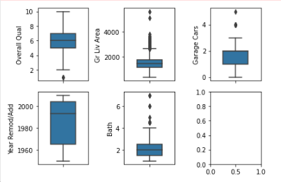  

---

### Multicollinearity

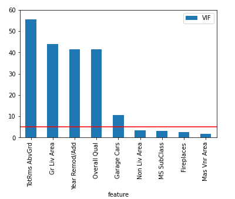  

We analysed the issue of multicollinearity and found out that there were 4 numerical features that failed the test.  
We tackled this issue by removing them.

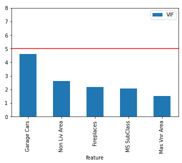    

After dropping the columns,  
setting the Threshold of VIF as 5, we can see that all of the numerical features passes the multi collinearity test.

---
### Categorical Data

We then identified that there are 7 nominal and 8 Ordinal data  
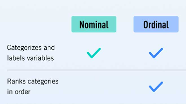  

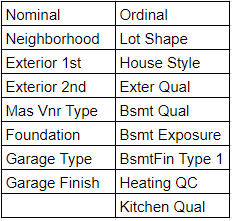  

Ordinal data are assigned integers based on ranking, while nominal data are one hot encoded.

---

### Models
we created 2 models, they are linear regression and Lasso derived from Grid search.

#### Linear regression
Linear Regression Train Score is :  0.02487525983519065
Linear Regression Test Score is :  0.030988624053013593
Percentage difference is -24.576081851311802%
Linear Regression intercept is :  10.650832045043877

The difference between train and test is more than 24% which shows that the model is over fitting.
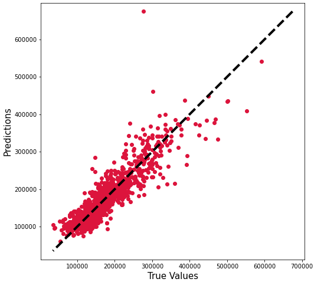  

#### Lasso  
MSE of Train is 0.033774128309880636,
MSE of Test is 0.033922649475397866,
Percentage diff: -0.4397483308955767%  
The Lasso model shows a much better generalization as compared to the linear regression model.  
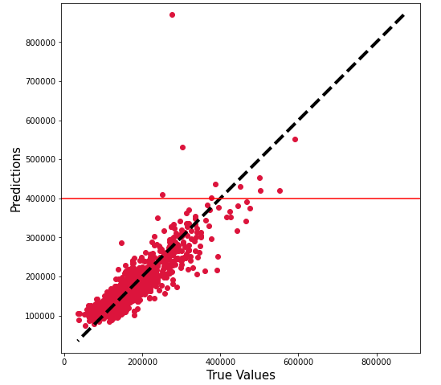

However from the above plot, we noted that the model seems to be ineffective in predicting prices above the 400,000 mark, with the tendency to over predict the sales price.

---

### Kaggle score

Even though the linear regression model is overfitted, it scores well in Kaggle  
  

As compared to the Lasso model  
  

---

### Conclusion  

Our model for implementation will be the Lasso Model, We have successfully reduced the number of features from the initial 80 down to 21 features more than 73% reduction. The new form will have 21 questions this will greatly improve customer's ease of use and will drastically reduce the drop out rate due to form complexity.

