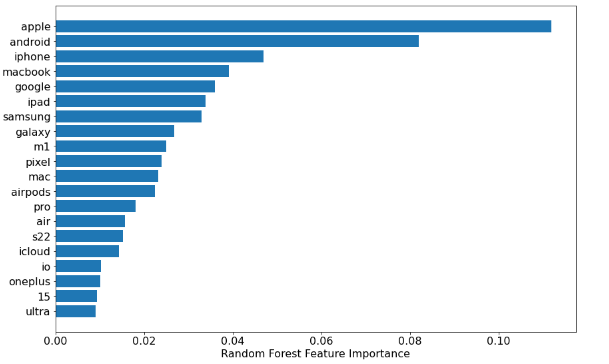

#  Project 3:

### Overview

Created a classification model to predict which subreddit a post belongs to, using Honda and Toyota subbreddit.

Work is devided in 3 noteboos:

1. [DataScraping.ipynb](https://git.generalassemb.ly/wei-hao/my_project/blob/master/project_3/01_data_collection.ipynb)
     Scraping data from sub reddit Api convert into a pandas data frame and creates csv files.
2. [EDA.ipynb](https://git.generalassemb.ly/wei-hao/my_project/blob/master/project_3/02_EDA_%26_Feature_engineering.ipynb)
     Cleaning, Feature engineering, Describing data, charts.
3. [Model.ipynb](https://git.generalassemb.ly/wei-hao/my_project/blob/master/project_3/03_Model.ipynb)
     spliting data in train and test data frames.
     Fitting data in model, scoring model, and ploting predictions and errors.
## Approach

We analysed post from r/Android & r/apple
10,000 posts per subreddit were scraped with the use of Pushshift API, a free API which allows the collection of text data from Reddit. Data cleaning and exploratory data analysis were performed to give an understanding of the data we collected with the API. 

### Methods
 - Statistic data description using Pandas,Numpy,wordcloud, librarys in Python.
 - Text columns were transformed Stopwords and WordNetLemmatize from nltk library.
 - Words were tokenized using CountVectorize & TfidfVectorizer from sklearn library
 - Data was slpit in 20% test and 80% train subsets.
 - Multinomial Naive Bayes, Random Trees, Support Vector Machine where used.

## Modelling

We then vectorized the final text dataset with either CountVectorizer or TF-IDF Vectorizer and modelled the text matrices with Multinomial Naive Bayes (MultinominalNB), Random Forest and Support Vector Machines model. We compared the performances of each model when used with either vectorization method and the summary of the results are shown below:

|Model|Generalization|AUC Score|
|---|---|---|
|Multinomial Naive Bayes and CountVectorizer|1.83|0.9436|
|Multinomial Naive Bayes and TF-IDF Vectorizer|2.36|0.9473
|Random Forest and CountVectorizer|1.31|0.9445|
|Random Forest and TF-IDF Vectorizer|1.36|0.9425|
|Support Vector Machines and CountVectorizer|4.55|0.9498|
|Support Vector Machines and TF-IDF Vectorizer|4.66|0.9466|

### Model Selection

AUC-ROC score was chosen to be the evaluation metric for comparing model performances as it provides an aggregate measure of performance across all possible classification thresholds.

The AUC-ROC score of the 6 models are very close to one another, as such the model's ability to generalise to data was chosen as the deciding factor in choosing our best model.
The Random Forest model using the CountVectorizer was selected as the best model based on its generalisation performance. with a % difference of only 1.31% between its Train and Test score.
     

 
### Feature importance of random forest  

In order to find out which word contributes most to the models prediction, we take a look at the feature_importances_ function.  
  
  
      
  
  
We can observe that model names (S22, macbook,ipad) , brands (Galaxy, Samsung, Oneplus, Pixel) and its associated products are important predictors in the random forest model.  
  
  

### Conclusions and Recommendations  

In summary, we recommend to utilize the Random Forest model to classify if a particular post belonged to either subreddit, with our model achieving a respectable AUC-ROC of 94.45%, and an low error rate at 14.48%

***
### Data source

[Android subreddit](https://www.reddit.com/r/Android/)

[Apple subreddit](https://www.reddit.com/r/apple/)

